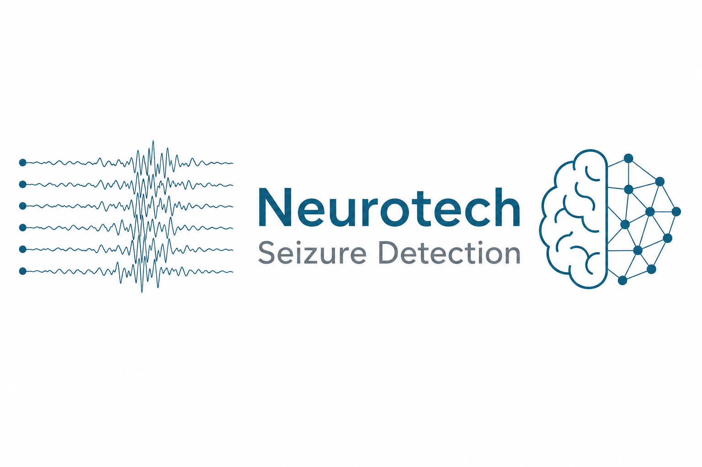
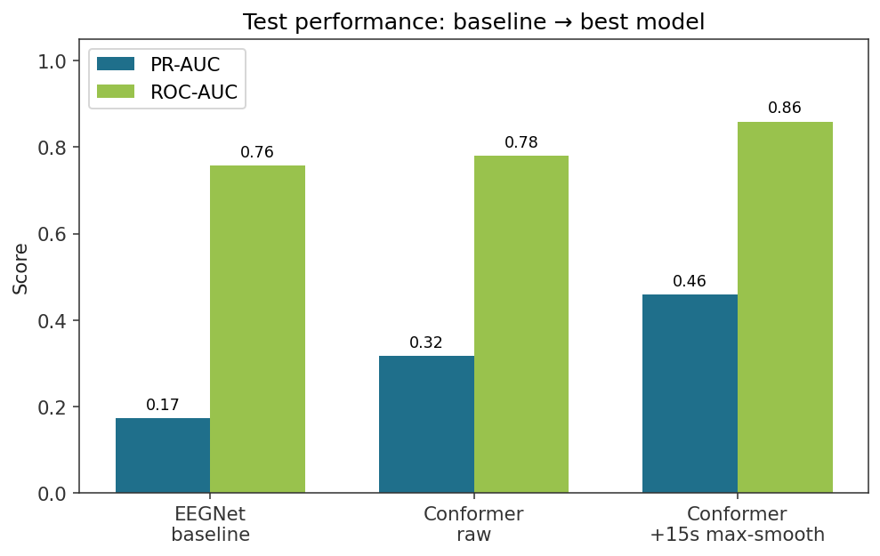
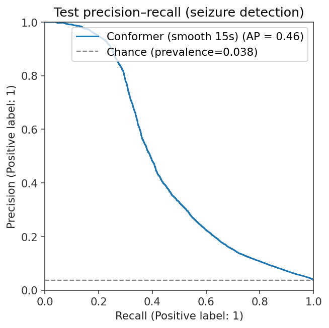
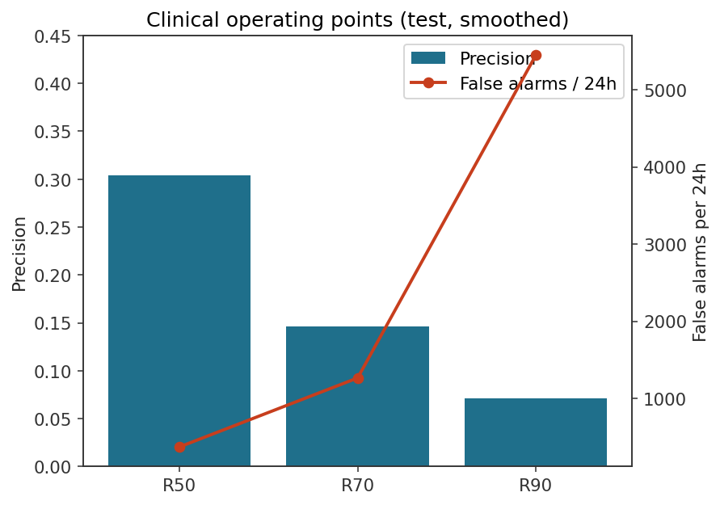
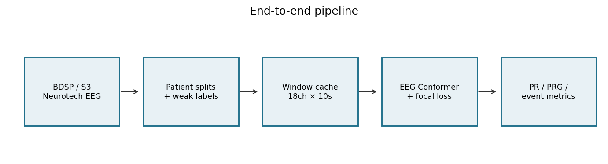

# EEG Seizure-Marker Proximity Detection



**Author:** [Kush Patel](mailto:patelskush@gmail.com)  
**Task:** patient-independent seizure-marker-proximity detection on scalp EEG  
**Stack:** PyTorch · MNE · memmap window cache · AWS/BDSP ingest

> **Not a medical device.** This repo detects windows near technician workflow seizure markers, not multi-expert gold-standard seizure intervals. Do not use for diagnosis, treatment, or unattended alarms.

[](pyproject.toml)
[](LICENSE)

---

## This repo vs the official dataset tooling

| | This project | Dataset authors' code |
|---|---|---|
| Purpose | ML detection pipeline, training, evaluation, showcase | BIDS conversion, de-ID, EHR extraction |
| GitHub | [Kush-S-Patel/eeg-seizure-detection](https://github.com/Kush-S-Patel/eeg-seizure-detection) | [`bdsp-core/Neurotech-EEG-Wrangling`](https://github.com/bdsp-core/Neurotech-EEG-Wrangling) |
| Contains EEG data? | No (code + lightweight metrics only) | N/A (points at BDSP download) |

**Dataset credits:** Morgan, K., Pickering, C., Goodwin, M., Wu, H., Ghanta, M., Gupta, A., Goldenholz, D., & Westover, M. B. (2026). *The Neurotech EEG Dataset* (version 1.0). Brain Data Science Platform. https://doi.org/10.60508/v99k-ek82

Access is credentialed under the BDSP DUA. Official project page / DOI are on [BDSP](https://bdsp.io/); the authors note that annotations are clinical workflow annotations, not multi-expert research labels.

---

## Highlights

- 10.2 TB clinical scalp EEG corpus (Neurotech / BDSP): 23,607 recordings, 4,914 patients, 212,186 hours
- End-to-end engineering: BIDS paths → Xltek weak labels → patient-level splits (zero leakage) → filter/resample → 244 GB window cache
- Detector: EEG Conformer + focal loss + TTA + temporal smoothing
- Metrics chosen for clinical relevance: PR-AUC, PRG-AUC, precision@recall, event FA/24h
- Honest null: preictal forecasting stayed near chance (failure analysis below)
- Classical baselines included: bandpower logistic regression and EEGNet CNN

### Headline test numbers (held-out patients)

| Model | PR-AUC | ROC-AUC | Δ PR-AUC vs spectral LR |
|---|---:|---:|---:|
| Logistic regression (bandpower) | 0.082 | 0.680 | — |
| EEGNet-style CNN | 0.174 | 0.757 | +0.09 |
| EEG Conformer (raw windows) | 0.318 | 0.780 | +0.24 |
| Conformer + 15 s max-smooth | **0.460** | **0.859** | **+0.38** |

The Conformer + smoothing stack beats bandpower logistic regression by 0.38 PR-AUC (0.082 → 0.460) and a compact EEGNet CNN by 0.29 PR-AUC (0.174 → 0.460) on the same held-out patients.



```text
Best: outputs/conformer_ft/best.pt
Eval: --smooth-seconds 15 --smooth-mode max
PR-AUC ≈ 0.46 (bootstrap 95% CI ≈ 0.44–0.48)  ·  ~12× test prevalence
Event sensitivity ≈ 60%  ·  ≈ 45 FA / 24h (SzCORE-style merge)
```




---

## Plain-language framing

**What it is:** a model that scores 10‑second EEG windows for proximity to technician seizure markers (±30 s).

**What it is not:** clinically validated seizure-interval detection, FDA-ready software, or a bedside alarm.

That wording matches the dataset's own limitations section.

---

## Pipeline



1. Collect credentialed Neurotech BIDS EEG + Xltek CSVs from BDSP  
2. Split by patient (train/val/test never share a person)  
3. Weak-label 10 s / 5 s-stride windows from marker proximity  
4. Preprocess once (18-ch bipolar, 0.5–45 Hz, 128 Hz) into a memmap cache  
5. Train Conformer with focal loss / imbalance handling  
6. Evaluate with PR/PRG, smoothing, event FA rates  

Full-scale path used rolling EC2 download → cache → delete raw EDF; cache archived to S3 (not in git).

---

## Why forecasting failed

I tried preictal forecasting (SOP/SPH windows minutes before estimated onsets). Results stayed near chance (~1.1× prevalence), and a bandpower logistic probe also failed — so this was not merely “need a bigger net.”

Likely drivers:
1. Scalp EEG preictal signal is weak or inconsistent across patients at multi-minute horizons  
2. Onsets are approximate (clusters of point markers), injecting horizon noise  
3. Existing windows were detection-subsampled, not densely tiled in the preictal band  
4. Patient-independent evaluation is much harder than patient-specific forecasting literature  

Documenting the null is deliberate: detection ≠ forecasting on this setup.

---

## Resources & citations

| Resource | Use |
|---|---|
| Neurotech EEG Dataset (BDSP) — [DOI 10.60508/v99k-ek82](https://doi.org/10.60508/v99k-ek82) | Data source (full citation above) |
| [`bdsp-core/Neurotech-EEG-Wrangling`](https://github.com/bdsp-core/Neurotech-EEG-Wrangling) | Authors' BIDS/de-ID pipeline (not this repo) |
| EEGNet; Conformer / attention-EEG papers | Model families |
| Focal loss; Flach & Kull PRG; SzCORE-style events | Training / metrics |
| [arXiv:2404.15332](https://arxiv.org/abs/2404.15332) | Clinical-translation metric discipline |

---

## Scope

| Lens | Verdict |
|---|---|
| Applied ML / engineering portfolio | Strong — quantifiable scale, leakage hygiene, clinical metrics, honest failure analysis |
| Clinical deployment | Not ready — weak labels; R90 precision ~7%; hundreds–thousands FA/day at high recall |

See [`docs/FAQ.md`](docs/FAQ.md) for design choices (splits, loss, metrics, windows, smoothing, cache).

---

## Showcase notebooks (no EEG data required)

```powershell
python -m pip install -e ".[notebooks]"
jupyter notebook notebooks/
```

| Notebook | Content |
|---|---|
| [`01_project_walkthrough.ipynb`](notebooks/01_project_walkthrough.ipynb) | Story + splits |
| [`02_detection_results.ipynb`](notebooks/02_detection_results.ipynb) | PR/ROC efficacy |
| [`03_clinical_reality_check.ipynb`](notebooks/03_clinical_reality_check.ipynb) | Operating points and limits |

Assets: [`docs/showcase/`](docs/showcase/). Regenerate figures: `python scripts/make_showcase_assets.py`.

---

## Quickstart (code only)

This clone does not include raw EDFs, the 244 GB cache, or full prediction CSVs.

```powershell
python -m pip install -e ".[dev,notebooks]"
python -m pytest tests -q
```

To reproduce training you need BDSP credentialed access + your own cache build (`scripts/`, `infra/`). Never commit `data/raw/`, `data/artifacts/window_cache/`, or full `outputs/`.

### Layout

```text
src/seizure_detector/   # models, engine, metrics, CLI
notebooks/              # lightweight demos
docs/showcase/          # committed metrics + figures (no PHI/EEG)
docs/FAQ.md             # design FAQ
scripts/                # ingest helpers, baselines, showcase builder
tests/
```

---

## Disclaimer

Research/education only. Dataset access requires a BDSP credentialed DUA. Respect HIPAA-oriented terms: no re-identification attempts. Weak workflow labels limit clinical ceiling.
